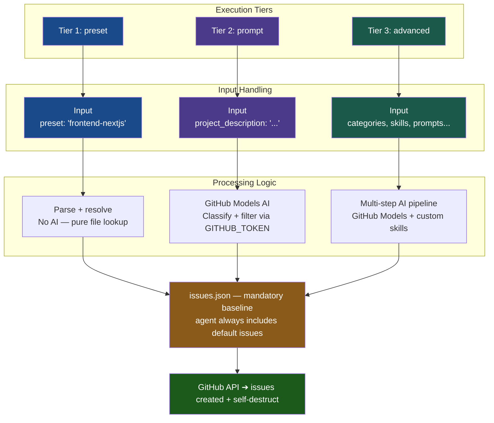

<!-- Don't delete it -->
<div name="readme-top"></div>

<!-- Organization Logo -->
<div align="center" style="display: flex; align-items: center; justify-content: center; gap: 16px;">
  
  
</div>

&nbsp;

<!-- Organization Name -->
<div align="center">

[](https://TODO.aossie.org/)

<!-- Correct deployed url to be added -->

</div>

<!-- Organization/Project Social Handles -->
<p align="center">
<!-- Telegram -->
<a href="https://t.me/StabilityNexus">
</a>
&nbsp;&nbsp;
<!-- X (formerly Twitter) -->
<a href="https://x.com/aossie_org">
</a>
&nbsp;&nbsp;
<!-- Discord -->
<a href="https://discord.gg/hjUhu33uAn">
</a>
&nbsp;&nbsp;
<!-- Medium -->
<a href="https://news.stability.nexus/">
  </a>
&nbsp;&nbsp;
<!-- LinkedIn -->
<a href="https://www.linkedin.com/company/aossie/">
  </a>
&nbsp;&nbsp;
<!-- Youtube -->
<a href="https://www.youtube.com/@AOSSIE-Org">
  </a>
</p>

---

<div align="center">
<h1>AutoInitialIssues</h1>
</div>

**AutoInitialIssues** is a powerful GitHub Action designed to automatically populate new repositories with a set of well-defined, categorized initial issues. By leveraging both preset issue banks and AI-powered generation (via GitHub Models), it helps maintainers quickly set up their projects with standard tasks, specialized framework-specific issues, and project-specific requirements.

---

- **Tiered Execution Modes**: Choose between `preset` (fast), `prompt` (tailored), and `advanced` (expert) modes.
- **AI-Powered Generation**: Integrates with GitHub Models (GPT-4o) to generate issues based on your project description.
- **Extensive Issue Banks**: Access pre-defined issues for `frontend`, `backend`, `blockchain`, `ml`, `mobile`, and `devops`.
- **Framework Specification**: Supports specific frameworks like `nextjs` and `express` for more relevant task generation.
- **Categorization & Skills**: Filter issue generation based on specific project categories and developer skills.

---

## 💻 Tech Stack

TODO: Update based on your project

### Backend
- Node.js (v20+)
- GitHub Actions SDK (`@actions/core`, `@actions/github`)

### AI/ML
- GitHub Models API (GPT-4o)
- Custom Prompt Engineering for Issue Generation

---

## ✅ Project Checklist

TODO: Complete applicable items based on your project type

- [x] **The AI/ML components**:
   - [x] LLM/model selection (GPT-4o) and configuration are documented.
   - [x] Prompts and system instructions are version-controlled in `src/agent.js`.
   - [x] API keys (GitHub Token) and rate limits are managed via GitHub Actions.

---

## 🏗️ Architecture Diagram

TODO: Add your system architecture diagram here



You can create architecture diagrams using:
- [Draw.io](https://draw.io)
- [Excalidraw](https://excalidraw.com)
- [Lucidchart](https://lucidchart.com)
- [Mermaid](https://mermaid.js.org) (for code-based diagrams)

Example structure to include:
- Frontend components
- Backend services
- Database architecture
- External APIs/services
- Data flow between components

---

## 🔄 User Flow

TODO: Add user flow diagrams showing how users interact with your application

```
[User Flow Diagram Placeholder]
```

### Key User Journeys

1. **Preset Setup**:
   - User adds `AutoInitialIssues` to their workflow.
   - User specifies `mode: preset` and `preset: frontend-nextjs`.
   - Action creates standard issues for Next.js and base project setup.

2. **AI-Tailored Setup**:
   - User specifies `mode: prompt` and provides a `project_description`.
   - Action calls GitHub Models API to generate context-aware issues.
   - Action creates a tailored set of issues in the repository.

---

## �🍀 Getting Started

### Prerequisites

TODO: List what developers need installed

- Node.js 18+ / Python 3.9+ / Flutter SDK
- npm / yarn / pnpm
- [Any specific tools or accounts needed]

### Installation

TODO: Provide detailed setup instructions

### Configuration

Add the following step to your `.github/workflows/main.yml`:

```yaml
- name: Auto Create Initial Issues
  uses: AOSSIE-Org/AutoInitialIssues@v1
  with:
    mode: 'prompt'
    project_description: 'A task management application built with Next.js and Supabase'
    github_token: ${{ secrets.GITHUB_TOKEN }}
```

#### Inputs

| Name | Description | Default |
|------|-------------|---------|
| `mode` | Execution mode: `preset`, `prompt`, or `advanced` | `preset` |
| `preset` | Preset string for Tier 1 (e.g., `frontend-nextjs`, `backend-express`) | - |
| `project_description` | Detailed description for AI generation (Required for `prompt`/`advanced`) | - |
| `project_template` | Hint for AOSSIE project template stack (e.g., `GIFT`, `AOSS`) | - |
| `categories` | Comma-separated categories to prioritize (e.g., `frontend,backend`) | - |
| `skills` | Comma-separated skills to emphasize (e.g., `React,Python`) | - |
| `max_issues` | Maximum number of issues to generate | `15` |
| `label_prefix` | Prefix to append to all generated issue labels | - |
| `github_token` | GitHub Token for API calls (Requires `issues: write` scope) | `${{ github.token }}` |

---

## 🛠️ How it Works

### 1. Mandatory Baseline
Every repository gets a set of foundational issues regardless of the mode selected. These include:
- **Set up project Code of Conduct**: Encouraging community standards.
- **Create Contributing Guidelines**: Helping new contributors get started.

### 2. Tiered Generation
- **Preset Mode**: Uses pre-defined JSON banks located in `issue-banks/`. It follows a `{category}-{framework}` naming convention.
- **Prompt/Advanced Mode**: Uses GitHub Models (GPT-4o) to intelligently select and adapt issues from the banks based on your `project_description`.

### 3. Issue Banks
The action maintains a library of issues categorized by area and framework:
- **Frontend**: `default`, `nextjs`
- **Backend**: `default`, `express`
- **Future Support**: Plans for `blockchain`, `ml`, `mobile`, and `devops`.

---

## 🚀 Getting Started

### Local Development

#### 1. Clone the Repository

```bash
git clone https://github.com/AOSSIE-Org/AutoInitialIssues.git
cd AutoInitialIssues
```

#### 2. Install Dependencies

```bash
npm install
```

#### 3. Build & Test

```bash
npm run build
npm test
```

For more detailed setup instructions, please refer to our [Installation Guide](./docs/INSTALL_GUIDE.md).

#### 6. Run Tests

The project uses [Jest](https://jestjs.io/) for unit testing. Tests cover the parser, issue creation, AI agent, and the main entrypoint with all external calls mocked.

```bash
npm test
```

---

## 🙌 Contributing

⭐ Don't forget to star this repository if you find it useful! ⭐

Thank you for considering contributing to this project! Contributions are highly appreciated and welcomed. To ensure smooth collaboration, please refer to our [Contribution Guidelines](./CONTRIBUTING.md).

---

## ✨ Maintainers

TODO: Add maintainer information

- [Maintainer Name](https://github.com/username)
- [Maintainer Name](https://github.com/username)

---

## 📍 License

This project is licensed under the GNU General Public License v3.0.
See the [LICENSE](LICENSE) file for details.

---

## 💪 Thanks To All Contributors

Thanks a lot for spending your time helping TODO grow. Keep rocking 🥂

[](https://github.com/AOSSIE-Org/TODO/graphs/contributors)

© 2025 AOSSIE 
